# Manhattan MCP Token Optimization Workflow

This document illustrates the workflow for the Manhattan MCP Token Optimization system, detailing how an agent interacts with the MCP to achieve token efficiency through normalization, chunking, deduplication, and smart retrieval.

## Workflow Concepts

This workflow implements the following key optimization strategies:

1.  **Pre-tokenized Context Storage**: Store processed tokens to avoid re-tokenization.
2.  **Semantic Chunking**: Split code into meaningful logic blocks.
3.  **Deduplication**: Store unique content once, reference many times.
4.  **Embedding-based Retrieval**: Fetch only relevant code segments.
5.  **Hierarchical Context Layers**: Summary first, details on demand.
6.  **Session Snapshots**: fast restore of previous context states.
7.  **Reference Pointers**: Lightweight IDs replacing heavy code blocks.
8.  **Delta Storage**: Store changes, not full copies.

## Visual Workflow Diagram

```mermaid
sequenceDiagram
    autonumber
    actor Agent
    participant MCP as MCP Orchestrator
    participant Proc as Processor
    participant DB as Vector/Content Store

    note right of Agent: Phase 1: Ingestion (Write)<br/>Goal: Minimize Storage & Maximize Structure

    Agent->>MCP: 1. Send Source Code (File/Diff)
    
    rect rgb(20, 20, 30)
        note right of MCP: Processing Pipeline
        MCP->>Proc: 2. Normalize Tokens
        Proc-->>MCP: Normalized Stream
        MCP->>Proc: 3. Semantic Chunking
        Proc-->>MCP: Chunks (Functions, Classes)
    end

    loop For Each Chunk
        MCP->>MCP: Compute Hash (Deduplication)
        MCP->>DB: Check Existence
        alt Chunk Exists
            DB-->>MCP: Return Reference Pointer (ID)
        else New Chunk
            MCP->>Proc: 4. Generate Embedding
            MCP->>DB: Store Tokenized Content & Embedding
            DB-->>MCP: Return New ID
        end
    end

    MCP->>DB: 6. Create Session Snapshot (List of Refs)
    DB-->>MCP: Snapshot ID
    MCP-->>Agent: Acknowledge (Context Updated)

    note right of Agent: Phase 2: Retrieval (Read)<br/>Goal: Minimize Token Usage in Prompt

    Agent->>MCP: Query Context ("Fix bug in auth")
    
    rect rgb(20, 20, 30)
        note right of MCP: Smart Retrieval
        MCP->>DB: 4. Embedding Search (Top-k Chunks)
        DB-->>MCP: Relevant Chunk IDs
        MCP->>DB: Fetch Snapshot (Current State)
    end
    
    MCP->>MCP: Filter Results by Snapshot Scope

    alt Hierarchical Retrieval Strategy
        MCP->>DB: Fetch Summaries (Signatures/Docs)
        DB-->>MCP: Lightweight Summaries
        MCP-->>Agent: 5. Return High-Level Context (Low Tokens)
        
        Agent->>MCP: Request Details (Select Specific IDs)
        MCP->>DB: 7. Resolve Reference Pointers
        DB-->>MCP: Retrieve Full Tokenized Body
        MCP-->>Agent: Return Targeted Full Context
    end

    opt Session Continuity
        Agent->>MCP: Restore Session
        MCP->>DB: Load Snapshot
        DB-->>MCP: All Active Reference Pointers
        MCP-->>Agent: Context Restored (Zero Token cost until Read)
    end
```

## Detailed Step-by-Step Explanation

### 1. Ingestion & Optimization
When code is sent to the MCP, it doesn't just get saved as text.
- **Normalization**: The code is tokenized and standardized (stripping non-semantic whitespace if configured) to ensure consistent hashing.
- **Chunking**: The file is parsed into semantic units (e.g., a Python function, a Class definition). This allows the agent to retrieve *just* a helper function later, rather than the whole module.
- **Deduplication**: We hash each chunk. If "UtilityFunctionA" is identical across 5 projects or 10 commits, we store it once. All other instances are just pointers (8. Delta/Pointer storage).

### 2. Retrieval & Usage
When the agent works, it needs information without flooding the context window.
- **Embedding Search**: The agent's natural language query finds relevant chunks even if keyword matches fail.
- **Hierarchical Layers**: The MCP initiates with a "Summary View" (5). It provides the agent with signatures and docstrings. If the agent needs to see the implementation of `login()`, it requests it specifically.
- **Snapshots**: If the agent crashes or restarts, the `Session Snapshot` (6) allows instant restoration of the "mental state" without re-reading the entire codebase.

This architecture treats the context window as a mostly-empty workspace where only currently necessary "tools" (code chunks) are placed, retrieved instantly from the vast warehouse (MCP) by looking up their location code (Pointer).
